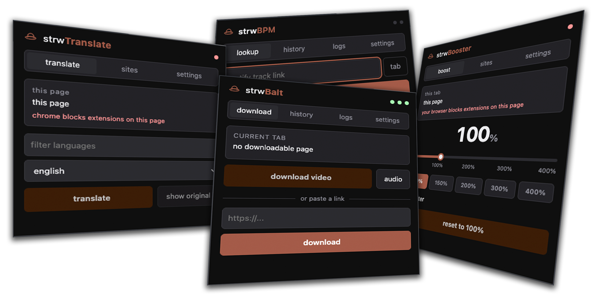

<div align="center">
    
    <h1>strwExtensions</h1>
    <p>
        extensions "I" made that simply just work without the bullshit
        <br>
        volume booster, youtube downloader, bpm checker & page translator
    </p>
</div>

## extended information
I've grown increasingly frustrated at extensions on the chrome webstore getting modified to be malicious, or for the extensions to not work/require a subscription to work, so my philosophy of "just make shit that works" grew on me and I decided to (and god forbid) vibe code these for my own personal workflow, and they just work with no bullshit.

<div align="center">
    
</div>

little history of how it started: I was visiting a russian website and I could not read ANYTHING, so my instinct was to find an extension to translate the pages. the 4 extensions I tried either didn't work, didn't do what I wanted or required a subscription to unlock basic features, so I got really frustrated and asked claude to generate me an extension. within 2 minutes I had a working, simple extension with 0 issues. **it just worked**.

another extension that was motivated by pure rage was the volume booster. I heard one of the volume booster extensions turned malicious, and that prompted me to vibe code another... **and it just worked.**

my friend asked me to make a local version of cobalt.tools, but I turned it into an extension, while routing certain things through ytdlp. **it also just works.**

same friend also asked me to make a BPM calculator extensions and well... you already know.

the idea of these are for you to **have them locally.** they're not on the chrome webstore because I want YOU to import them and for YOU to have control over it. if I ever turn malicious or get hacked, the chrome webstore extension could be targeted, and this just fully fixes that issue.

## okay but isn't this vibe coded slop?
well, in a sense, yea! it is vibe coded. now, would I call it slop? well, I tried by best to make it as simple as possible to the point where it just works. I am also not charging any money for this, and it's under the WTFPL license, so you can just do whatever the fuck you want with it. I don't want to make any money out of this. I just want to give people who NEED IT a good, working alternative with no bullshit and no "You ran out of Credits" pop up for the 3rd use.

I'd be very glad if someone decided to take these extensions and remade them without using AI. I would even redirect users looking to use this to that repository as a non-AI alternative, but I digress.

## it no work on firefox
I made these extensions for me, so since I am using a chromium based browser (helium), I didn't factor in support for other browsers. maybe one day if I am not lazy I'll add firefox (zen, waterfox, etc) support.

## license
```
        DO WHAT THE FUCK YOU WANT TO PUBLIC LICENSE 
                    Version 2, December 2004 

 Copyright (C) 2004 Sam Hocevar <sam@hocevar.net> 

 Everyone is permitted to copy and distribute verbatim or modified 
 copies of this license document, and changing it is allowed as long 
 as the name is changed. 

            DO WHAT THE FUCK YOU WANT TO PUBLIC LICENSE 
   TERMS AND CONDITIONS FOR COPYING, DISTRIBUTION AND MODIFICATION 

  0. You just DO WHAT THE FUCK YOU WANT TO.
  ```
